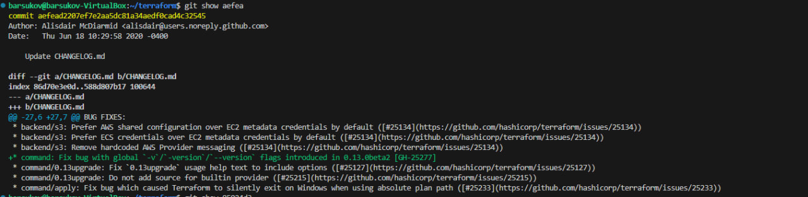
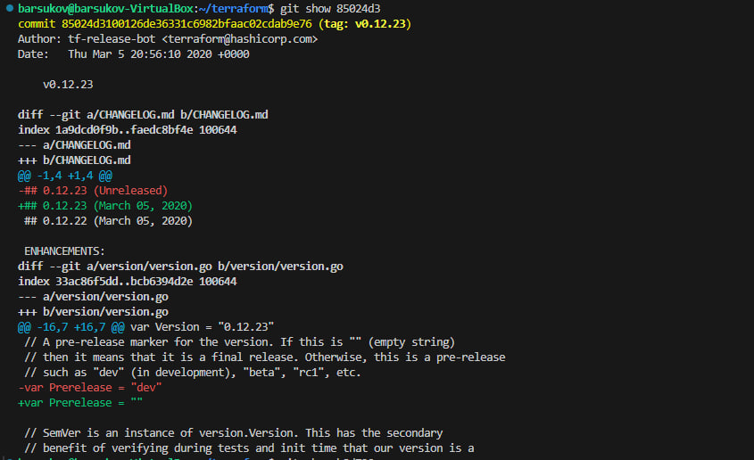
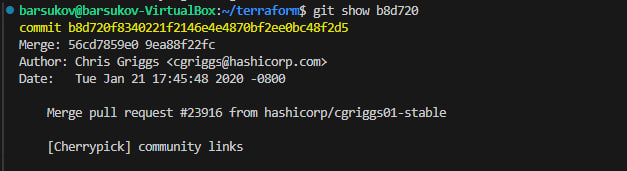
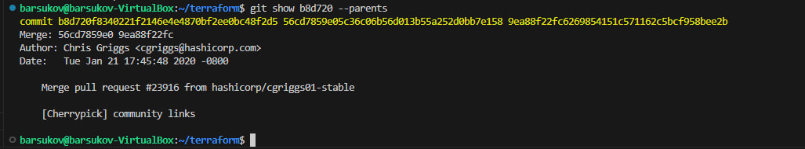
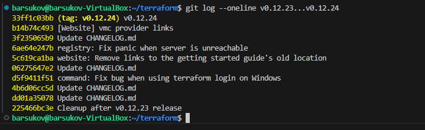
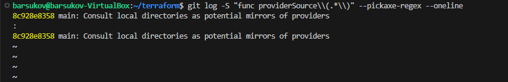
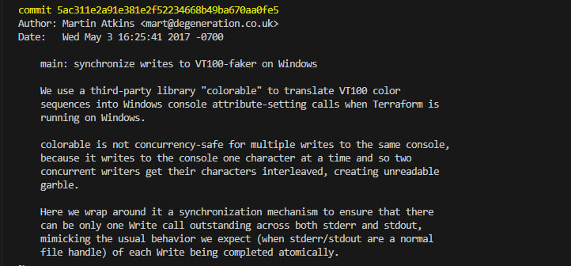

# Домашнее задание к занятию «Инструменты Git» Барсуков А.А

### Цель задания

В результате выполнения задания вы:

* научитесь работать с утилитами Git;
* потренируетесь решать типовые задачи, возникающие при работе в команде. 

### Инструкция к заданию

1. Склонируйте [репозиторий](https://github.com/hashicorp/terraform) с исходным кодом Terraform.
2. Создайте файл для ответов на задания в своём репозитории, после выполнения прикрепите ссылку на .md-файл с ответами в личном кабинете.
3. Любые вопросы по решению задач задавайте в чате учебной группы.

------

## Задание

В клонированном репозитории:

1. Найдите полный хеш и комментарий коммита, хеш которого начинается на `aefea`.
2. Ответьте на вопросы.

* Какому тегу соответствует коммит `85024d3`?
* Сколько родителей у коммита `b8d720`? Напишите их хеши.
* Перечислите хеши и комментарии всех коммитов, которые были сделаны между тегами  v0.12.23 и v0.12.24.
* Найдите коммит, в котором была создана функция `func providerSource`, её определение в коде выглядит так: `func providerSource(...)` (вместо троеточия перечислены аргументы).
* Найдите все коммиты, в которых была изменена функция `globalPluginDirs`.
* Кто автор функции `synchronizedWriters`? 

*В качестве решения ответьте на вопросы и опишите, как были получены эти ответы.*

---

### Правила приёма домашнего задания

В личном кабинете отправлена ссылка на .md-файл в вашем репозитории.

### Критерии оценки

Зачёт:

* выполнены все задания;
* ответы даны в развёрнутой форме;
* приложены соответствующие скриншоты и файлы проекта;
* в выполненных заданиях нет противоречий и нарушения логики.

На доработку:

* задание выполнено частично или не выполнено вообще;
* в логике выполнения заданий есть противоречия и существенные недостатки.

### ОТВЕТ
1. Полный хеш: aefead2207ef7e2aa5dc81a34aedf0cad4c32545  
   Комментарий: Update CHANGELOG.md  
   Команда для получения: git show aefea

2. Коммит 85024d3 соответствует тегу v0.12.23  
   Команда для получения: git show 85024d3

3. У коммита b8d720 2 родителя 56cd7859e и 9ea88f22f  
   Команда для получения: git show b8d720. Либо можно git show b8d720 --parents, тогда будут отображены полные хеш-суммы.

4. Список коммитов между тегами v0.12.23 и v0.12.24:
   
   Хеш-сумма | Комментарий
   --------- | -----------
   b14b74c49 | [Website] vmc provider links
   3f235065b | Update CHANGELOG.md
   6ae64e247 | registry: Fix panic when server is unreachable
   5c619ca1b | website: Remove links to the getting started guide's old location
   06275647e | Update CHANGELOG.md
   d5f9411f5 | command: Fix bug when using terraform login on Windows
   4b6d06cc5 | Update CHANGELOG.md
   dd01a3507 | Update CHANGELOG.md
   225466bc3 | Cleanup after v0.12.23 release
   
   Команда для получения: git log --oneline v0.12.23...v0.12.24
   

6. В первый раз функция "providerSource" упоминается в коммите "8c928e835" с комментарием "main: Consult local directories as potential mirrors of providers"  
   Команда для получения: git log -S "func providerSource\\(.*\\)" --pickaxe-regex --oneline

7. Список коммитов в которых была изменена функция globalPluginDirs:

   Хеш-сумма | Комментарий
   --------- | -----------
   78b122055 | Remove config.go and update things using its aliases
   52dbf9483 | keep .terraform.d/plugins for discovery
   41ab0aef7 | Add missing OS_ARCH dir to global plugin paths
   66ebff90c | move some more plugin search path logic to command
   8364383c3 | Push plugin discovery down into command package

   Команды для получения:
   1. Определяем что функция появилась в коммите 8364383c3 при помощи команды "git log -S "func globalPluginDirs\(.*\)" --pickaxe-regex --oneline"
   2. Определяем что функция находится в файле plugins.go при помощи команды "git grep -p "func globalPluginDirs\(.*\)" 8364383c3"
   3. Находим коммиты с изменением в теле функции при помощи команды "git log -L :globalPluginDirs:plugins.go --oneline"
8. Автором функции "synchronizedWriters" является Martin Atkins.  
   Команда для получения: git log -S "func synchronizedWriters\(.*\)" --pickaxe-regex

